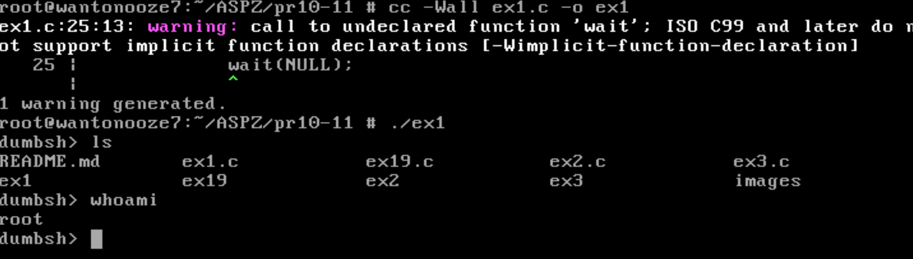
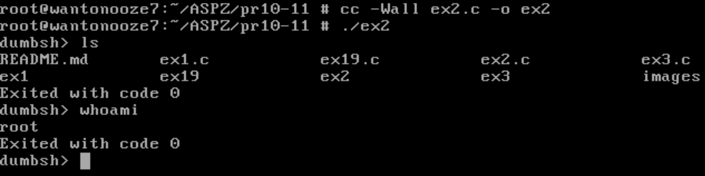
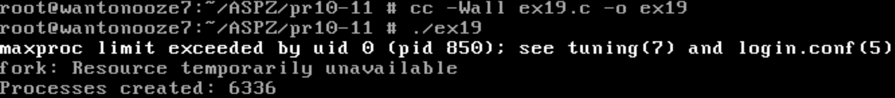

# Практична робота №10-11

**Тема:** Process Creation у Linux

---

## Завдання 1

### Опис

Програма [`ex1.c`](ex1.c) — це проста оболонка (shell), яка зчитує команду користувача, створює дочірній процес через `fork()`, виконує команду за допомогою `execlp()`, а батьківський процес чекає завершення дочірнього. Вихід з оболонки — командою `exit`.

---

## Завдання 2

### Опис

Програма [`ex2.c`](ex2.c) — оболонка, яка додатково після виконання команди виводить код завершення процесу або номер сигналу, яким завершено процес. Це дозволяє побачити, як завершилась команда (нормально чи через сигнал).

---

## Завдання 3

### Опис

Програма [`ex3.c`](ex3.c) — оболонка, яка перед виконанням команди користувача створює три дочірніх процеси (які просто виводять свій номер і завершуються), чекає їх завершення, а потім виконує команду користувача як у попередніх завданнях.

---

### Варіант 19

### Опис

Програма [`ex19.c`](ex19.c) демонструє, скільки процесів можна створити у системі до вичерпання ліміту. Вона у циклі викликає `fork()`, кожен дочірній процес одразу завершується, а батьківський продовжує створювати нові процеси. Коли система більше не може створити новий процес (fork повертає -1), цикл завершується і виводиться кількість створених процесів.

---