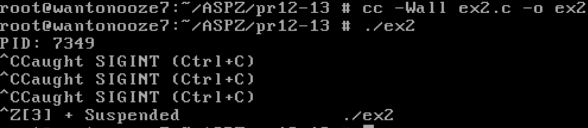
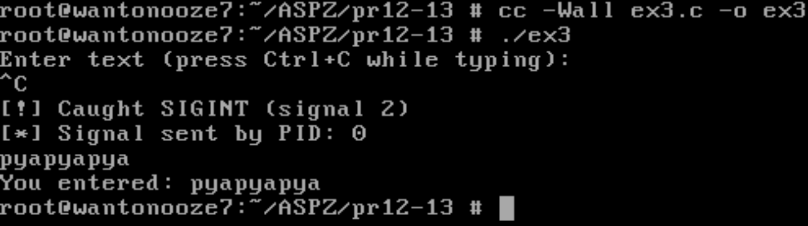
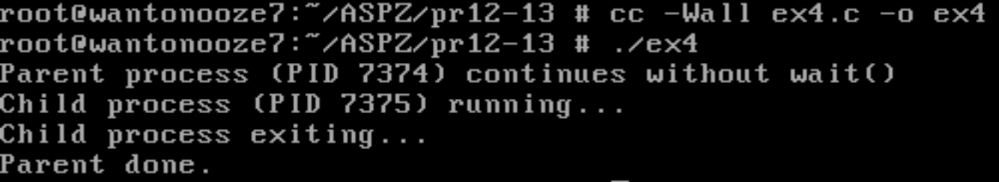
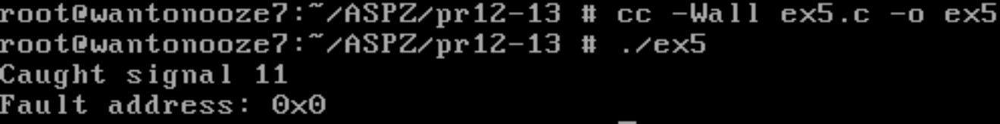
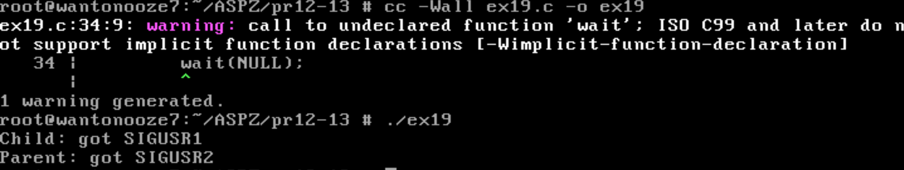

# Практична робота №12-13

## Тема

**Обробка сигналів у процесах, взаємодія між процесами через сигнали**

### Завдання 1 [`ex1.c`](ex1.c)

Обробка сигналу SIGINT (Ctrl+C) у нескінченному циклі. При натисканні Ctrl+C виводиться повідомлення, але програма не завершується.

---

### Завдання 2 [`ex2.c`](ex2.c)

Обробка сигналів SIGINT та SIGTERM. При SIGINT (Ctrl+C) виводиться повідомлення, при SIGTERM — програма коректно завершується. Виводиться PID для зручності надсилання сигналів.

---

### Завдання 3 [`ex3.c`](ex3.c)

Використання розширеного обробника сигналу SIGINT з інформацією про відправника (PID). Читання з stdin може бути перерване сигналом, але завдяки SA_RESTART системний виклик повторюється.

---

### Завдання 4 [`ex4.c`](ex4.c)

Демонстрація уникнення зомбі-процесів за допомогою SA_NOCLDWAIT. Батьківський процес не викликає wait(), але дочірній не стає зомбі.

---

### Завдання 5 [`ex5.c`](ex5.c)

Обробка сигналу SIGSEGV (сегментаційна помилка) з виведенням адреси помилки через info->si_addr. Викликається навмисно через звернення до NULL-указівника.

---

### Завдання 6 [`ex6.c`](ex6.c) та Завдання 7 [`ex7.c`](ex7.c)

**ex6.c** — процес-підписник, який чекає сигналу реального часу SIGRTMIN з додатковим цілим значенням (через sigqueue). Виводить PID відправника та значення.

**ex7.c** — процес-відправник, який надсилає SIGRTMIN іншому процесу (PID передається аргументом) з додатковим значенням (sival_int = 99).

---
### Варіант 19
## Опис завдання

У цьому завданні реалізовано програму [`ex19.c`](ex19.c), яка демонструє взаємодію між батьківським і дочірнім процесами за допомогою сигналів `SIGUSR1` та `SIGUSR2`.

- Дочірній процес очікує сигналу `SIGUSR1` від батьківського процесу.
- Після отримання сигналу виводить повідомлення та надсилає батьківському процесу сигнал `SIGUSR2`.
- Батьківський процес після запуску дочірнього чекає короткий час, надсилає дочірньому сигнал `SIGUSR1`, а потім очікує сигналу `SIGUSR2` від дочірнього.
- Після отримання сигналу виводить повідомлення та завершує роботу.

---

---