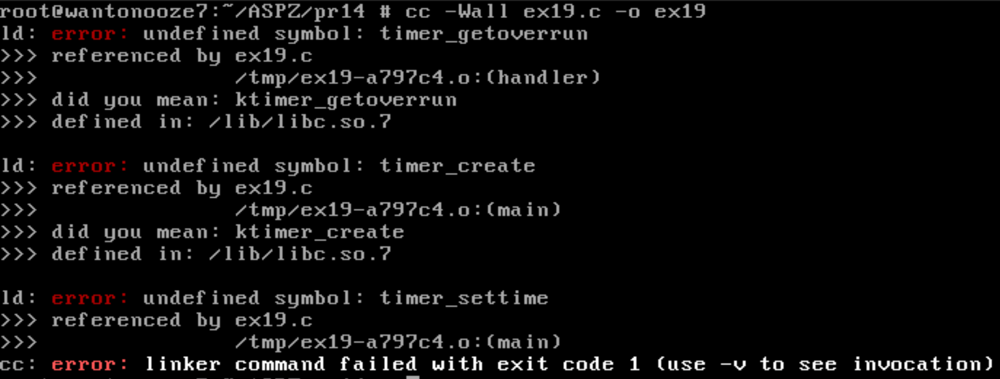
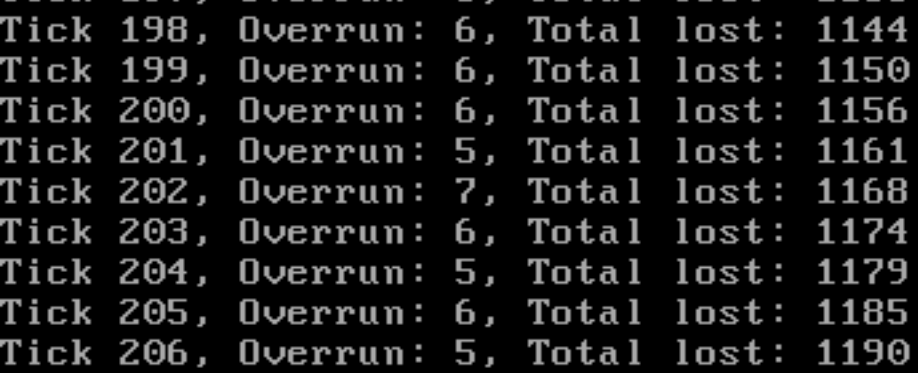

# Практична робота №14

## Тема

**Високоточні таймери, обробка сигналів, втрати сигналів через перевантаження**

---

## Опис завдання

У цьому завданні реалізовано програму [`ex19.c`](ex19.c), яка демонструє використання POSIX-таймера з високою частотою та обробку сигналів реального часу (`SIGRTMIN`). Програма вимірює, скільки сигналів було втрачено через перевантаження обробника (overrun).

---

## Основні етапи роботи програми

- Створюється таймер, який надсилає сигнал `SIGRTMIN` кожні 10 мс.
- Обробник сигналу підраховує кількість оброблених сигналів та кількість пропущених (overrun).
- Для імітації перевантаження у обробнику штучно створюється затримка.
- Після 5 секунд роботи програма виводить статистику: скільки сигналів було оброблено і скільки втрачено.

---

## Проблема

Звичайна компіляція видає помилку 

```bash
cc -Wall ex19.c -o ex19
```

---

## Правильне використання 

```bash
cc -Wall ex19.c -o ex19
```

- Tick 204 — це номер обробленого сигналу.

- Overrun: 5 — означає, що за час обробки попереднього сигналу накопичилось ще 5, які не були оброблені.

- Total lost: 1179 — загальна кількість втрачених тиків, які не були доставлені окремими сигналами через перевантаження.



---