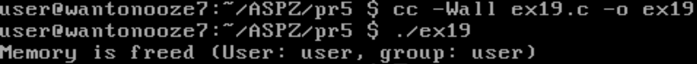
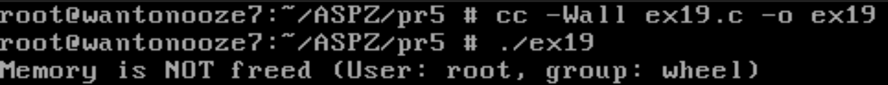
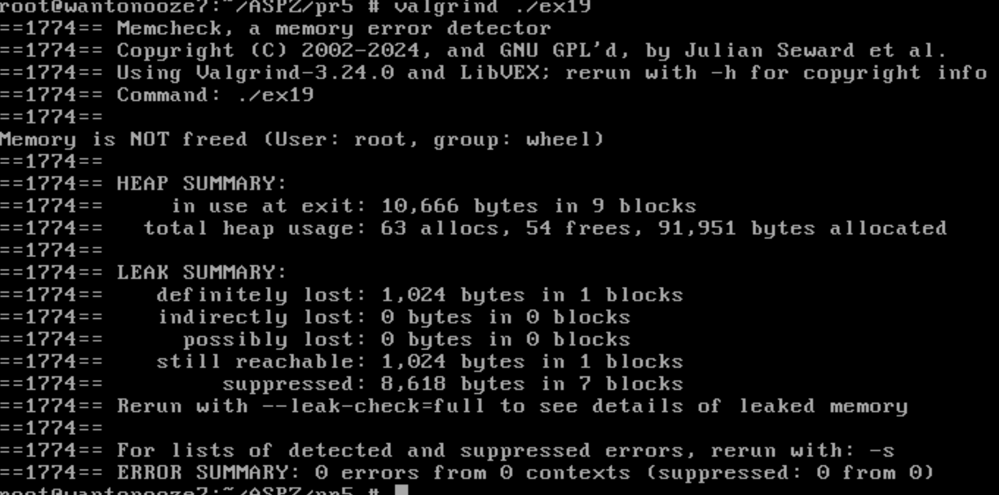

# Практична робота №5. Про помилки роботи з пам’яттю в Linux та засоби їх усунення

## Мета
Ознайомитися з типовими помилками при роботі з динамічною пам’яттю в мовах C/C++ у середовищі Linux, навчитися виявляти й уникати витоків пам’яті, зрозуміти вплив ідентифікаторів користувачів та груп на поведінку програм.

## Опис
Цей проєкт містить програму на мові C , яка демонструє витік пам’яті на FreeBSD. Програма виділяє пам’ять і не звільняє її, якщо запускається певним користувачем, або групою.

## Як працює
Програма перевіряє ім’я користувача та групи, які запустили процес. Якщо ім’я збігається з цільовим ("root" або "student"), пам’ять не звільняється, що викликає витік. В інших випадках пам’ять звільняється коректно.

## Використання
Запустіть програму від різних користувачів:
- Звичайний користувач:
  ```
  ./ex19.c
  ```
  
- Цільовий користувач:
  ```
  root: ./ex19.c
  ```
  

## Перевірка витоків
Використовуйте `valgrind`:
```bash
valgrind ./ex19.c
```
Для цільового користувача/групи Valgrind покаже витік пам’яті (1024 байти).


