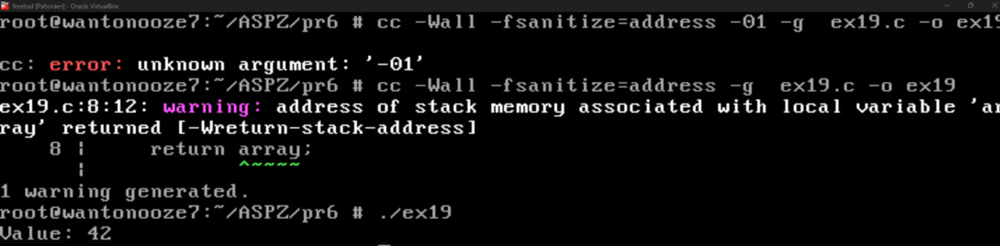
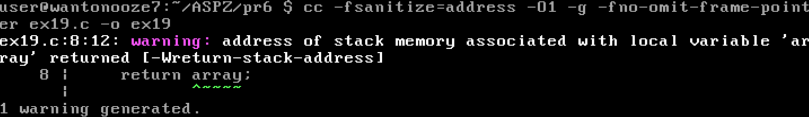
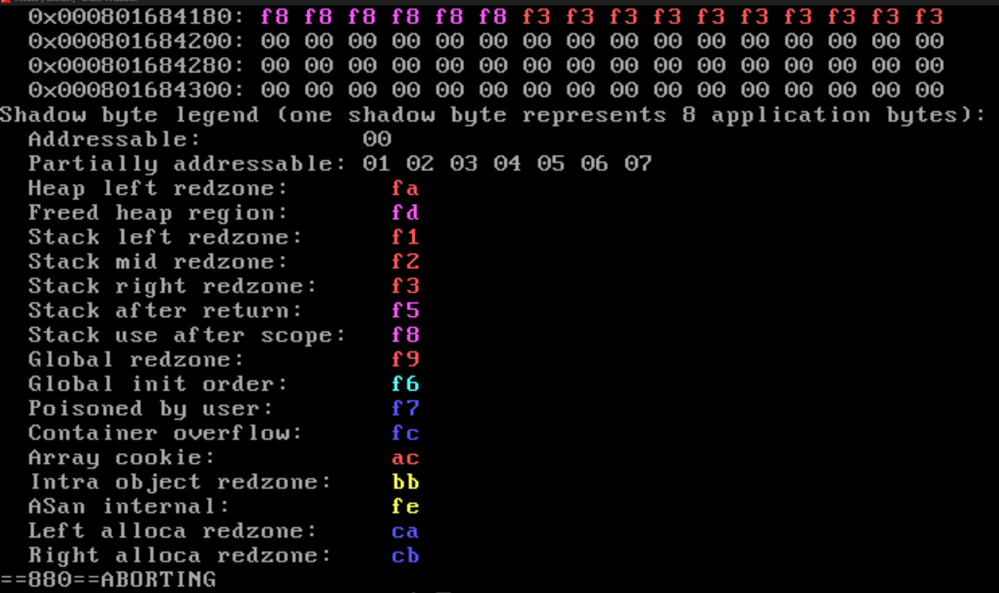

# Практична №6 

## Опис

Цей приклад демонструє помилку типу **use-after-return** у C.  
Функція `get_buffer` повертає вказівник на локальний стековий масив, який стає недійсним після завершення функції.  
Використання цього вказівника у `main` призводить до невизначеної поведінки.

## Як зібрати та запустити з AddressSanitizer

1.1 **Компіляція коду з -Wall:**

   ```
   cc -Wall ex19.c -o ex19.exe
   ```
   

1.2 **Компіляція коду з AddressSanitizer:**
   ```
   clang -fsanitize=address -O1 -g -fno-omit-frame-pointer -o ex19 19.c

   ASAN_OPTIONS=detect_stack_use_after_return=1 ./ex19
   ```

   

2. **Запустіть з перевіркою use-after-return:**

   ```
   ASAN_OPTIONS=detect_stack_use_after_return=1
   .\ex19.exe
   ```
   
## Результат

AddressSanitizer виявить помилку use-after-return та виведе відповідне попередження у консолі.
