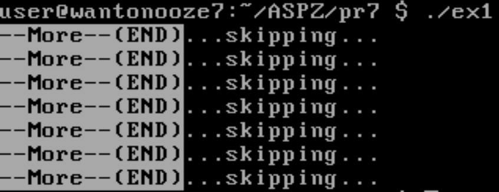
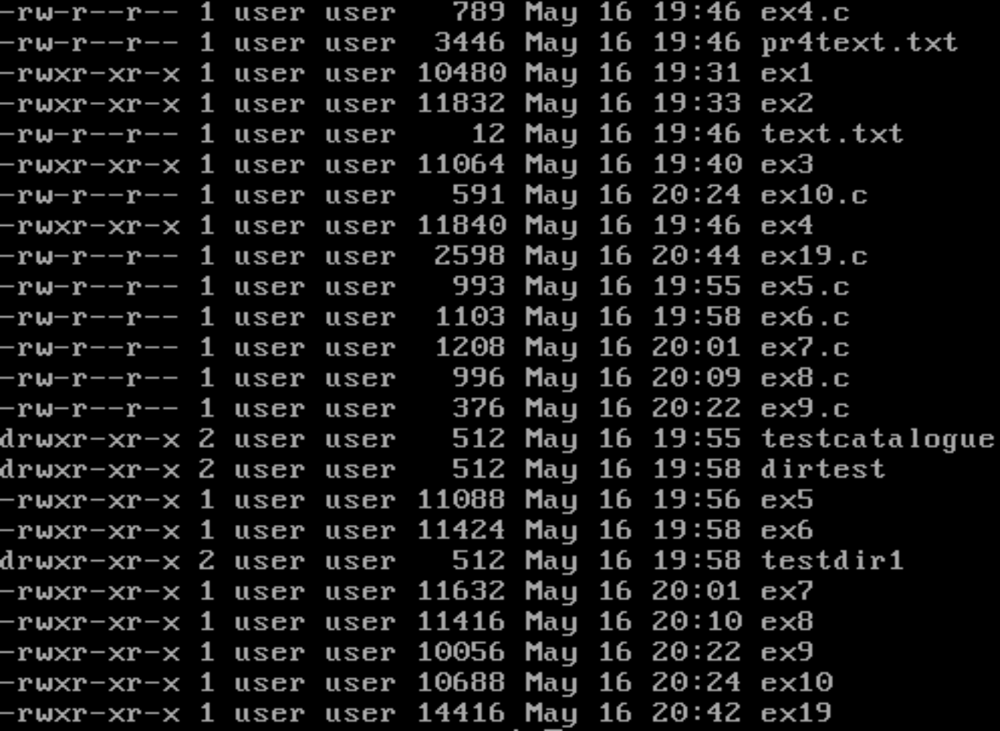
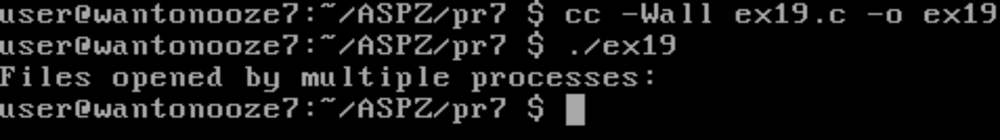

# Практична робота №7

## Завдання №1
**Передача виводу команди `rwho` до `more` через popen.**

**Пояснення:**  
Програма демонструє використання функції `popen()` для організації конвеєра між двома командами UNIX. Вона запускає команду `rwho` для отримання списку користувачів у мережі, читає її вивід і передає його на вхід команді `more` для посторінкового перегляду. Це приклад міжпроцесної взаємодії через стандартні потоки.

**Реалізація:**  
Використовується подвійний виклик `popen`: один для читання виводу `rwho`, другий — для запису у вхідний потік `more`. Програма читає дані з одного потоку і передає їх у інший, поки не закінчиться вивід.

---

## Результат роботи:

---

## Завдання №2

**Імітація `ls -l`: вивід списку файлів з правами доступу.**

**Пояснення:**  
Програма реалізує базову функціональність команди `ls -l` без використання зовнішніх утиліт. Вона відкриває поточний каталог, перебирає всі файли, отримує їх атрибути (тип, права доступу, власник, група, розмір, дата зміни) і виводить цю інформацію у форматі, подібному до стандартного `ls -l`. Це демонструє роботу з файловою системою та атрибутами файлів на низькому рівні.

**Реалізація:**  
Використовується функції `opendir`, `readdir`, `stat` для отримання інформації про кожен файл. Права доступу, власник, група, розмір і дата форматуються та виводяться у вигляді таблиці.

---

## Результат роботи:

---

## Завдання №3
**Пошук рядків з файлу, що містять задане слово (імітація `grep`).**

**Пояснення:**  
Програма приймає слово та ім'я файлу як аргументи, відкриває файл і виводить лише ті рядки, які містять задане слово. Це спрощена версія утиліти `grep`, яка демонструє роботу з текстовими файлами, пошук підрядків та обробку аргументів командного рядка.

**Реалізація:**  
Використовується функція `fgets` для читання рядків з файлу та `strstr` для пошуку підрядка. Якщо слово знайдено — рядок виводиться на екран.

---

## Результат роботи:

---

## Завдання №4
**Вивід файлів з паузою кожні 20 рядків (імітація `more`).**

**Пояснення:**  
Програма читає вміст одного або кількох файлів і виводить його на екран, зупиняючись кожні 20 рядків і чекаючи натискання клавіші Enter для продовження. Це демонструє організацію посторінкового виводу, подібно до утиліти `more`, і роботу з буферизованим введенням/виведенням.

**Реалізація:**  
Після кожних 20 виведених рядків програма зупиняється і чекає на натискання Enter (`getchar()`), після чого продовжує вивід.

---

## Результат роботи:

---

## Завдання №5
**Рекурсивний вивід усіх файлів у поточному каталозі та підкаталогах.**

**Пояснення:**  
Програма рекурсивно обходить поточний каталог і всі його підкаталоги, виводячи повні шляхи до всіх знайдених файлів. Це приклад використання рекурсії для обходу файлової системи та роботи з директоріями.

**Реалізація:**  
Використовується рекурсивна функція, яка для кожного підкаталогу викликає сама себе. Для кожного знайденого файлу виводиться його повний шлях.

---

## Результат роботи:

---

## Завдання №6
**Вивід лише підкаталогів у алфавітному порядку.**

**Пояснення:**  
Програма знаходить усі підкаталоги у поточному каталозі, сортує їх у алфавітному порядку і виводить на екран. Це демонструє роботу з каталогами, сортуванням рядків і динамічним виділенням пам'яті.

**Реалізація:**  
Імена підкаталогів зберігаються у масиві, після чого масив сортується (наприклад, бульбашковим методом або `qsort`) і виводиться.

---

## Результат роботи:

---

## Завдання №7
**Інтерактивна зміна прав доступу на читання для виконуваних файлів користувача.**

**Пояснення:**  
Програма знаходить усі виконувані файли користувача у поточному каталозі, показує їх і для кожного запитує, чи потрібно надати іншим користувачам дозвіл на читання. У разі згоди змінює права доступу. Це приклад роботи з правами доступу, системним викликом `chmod` та інтерактивною взаємодією з користувачем.

**Реалізація:**  
Для кожного виконуваного файлу програма виводить питання та, у разі позитивної відповіді, змінює права доступу через `chmod`.

---

## Результат роботи:

---

## Завдання №8
**Інтерактивне видалення файлів у поточному каталозі.**

**Пояснення:**  
Програма перебирає всі звичайні файли у поточному каталозі і для кожного запитує, чи слід його видалити. Видалення виконується лише за підтвердженням користувача. Це демонструє роботу з видаленням файлів (`remove`) та організацію безпечного інтерфейсу для користувача.

**Реалізація:**  
Для кожного файлу програма виводить питання. Користувач може відповісти:  
- `y` або `Y` — видалити поточний файл  
- `n` або `N` — пропустити файл  
- `a` або `A` — видалити цей файл та всі наступні без додаткових запитів  
- `q` або `Q` — завершити програму  
Видалення виконується через `remove()`. Програма обробляє помилки та забезпечує контрольований процес видалення.

---

## Результат роботи:

---

## Завдання №9
**Вимірювання часу виконання фрагмента коду у мілісекундах.**

**Пояснення:**  
Програма вимірює час виконання певного фрагмента коду з точністю до мілісекунд, використовуючи функції роботи з часом (`clock` або `gettimeofday`). Це корисно для аналізу продуктивності та оптимізації програм.

**Реалізація:**  
Перед і після виконання фрагмента коду зберігається поточний час. Різниця переводиться у мілісекунди та виводиться на екран.

---

## Результат роботи:

---

## Завдання №10
**Генерація послідовності випадкових чисел з плаваючою комою у заданому діапазоні.**

**Пояснення:**  
Програма генерує послідовність випадкових чисел з плаваючою комою у діапазоні [0.0; 1.0] або [0.0; n], де n задається користувачем. Початкове значення генератора встановлюється так, щоб забезпечити унікальність послідовності. Це демонструє роботу з генерацією випадкових чисел та обробкою аргументів командного рядка.

**Реалізація:**  
Використовується функція `rand()` для генерації чисел, які масштабуються у потрібний діапазон. Початкове значення генератора встановлюється з урахуванням часу та адреси змінної.

---

## Результат роботи:

---

## Завдання 19 (варіант)

**Виявлення неочевидних залежностей між файлами і процесами, що їх використовують.**

**Пояснення:**  
Програма аналізує відкриті файлові дескриптори всіх процесів у системі (через `/proc`), знаходить файли, які відкриті кількома процесами одночасно, і виводить відповідні PID. Це дозволяє виявити неочевидні залежності між процесами та файлами, що може бути корисно для діагностики та аналізу роботи системи.

**Реалізація:**  
Програма перебирає всі каталоги `/proc/[pid]/fd`, читає символьні посилання на відкриті файли, будує таблицю відповідностей "файл — список PID", і виводить ті файли, які відкриті більш ніж одним процесом.

---

## Результат роботи:
