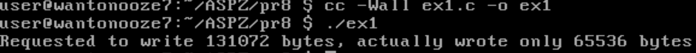
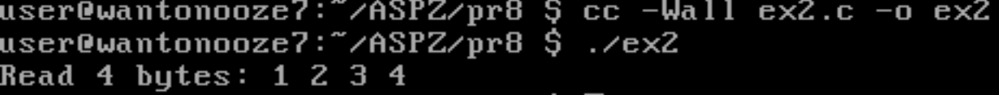
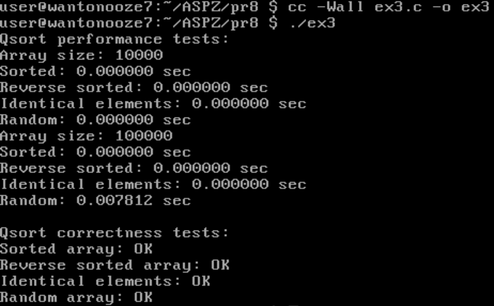
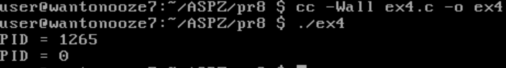
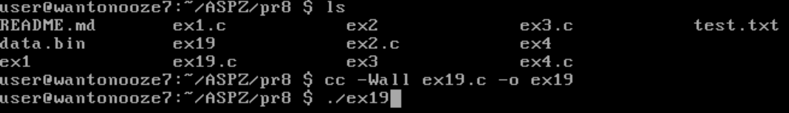

# Практична робота №8  
**Тема:** Системні виклики в UNIX/POSIX (файлові операції, fork(), qsort(), write(), read(), lseek() тощо)  

---

## Зміст

1. [Завдання 8.1](#завдання-81) — Повний або частковий запис `write()`  
2. [Завдання 8.2](#завдання-82) — Використання `lseek()` та `read()` для позиціювання і зчитування файлу  
3. [Завдання 8.3](#завдання-83) — Аналіз роботи `qsort()` з різними вхідними даними та написання тестів  
4. [Завдання 8.4](#завдання-84) — Демонстрація роботи `fork()`  
5. [Завдання 19](#Варіантне-завдання-19) — Демонстрація роботи `fork()`  
---

## Завдання 8.1

**Мета:**  
Дослідити, чи може системний виклик `write(fd, buffer, nbytes)` повернути значення, відмінне від `nbytes`.

**Результат:**  
Програма створює pipe, встановлює його в неблокуючий режим і намагається записати великий буфер (128 КБ). Через обмежений розмір буфера pipe, `write()` може записати менше байт, ніж запитано. Виводиться кількість фактично записаних байт.

---

## Завдання 8.2

**Мета:**  
Дослідити, що поверне `read()` після переміщення файлового покажчика за допомогою `lseek()`.

**Результат:**  
Програма створює файл з послідовністю байтів і виконує `lseek(fd, 3, SEEK_SET)`, після чого зчитує 4 байти. Виводиться вміст буфера після читання. Показано, що `read()` читає з позиції, на яку вказує файловий покажчик.

---

## Завдання 8.3

**Мета:**  
- Написати функцію порівняння для `qsort()`.
- Провести експерименти з різними вхідними масивами, щоб знайти найгірші для швидкого сортування випадки.
- Автоматизувати підбір вхідних даних.
- Реалізувати набір тестів для перевірки коректності сортування.

**Результат:**  
Реалізовано програму, що сортує масиви різного виду (випадкові, відсортовані, зворотно відсортовані, з великою кількістю повторів) і заміряє час виконання. Також додані тести для перевірки правильності сортування.

---

## Завдання 8.4

**Мета:**  
Показати, як працює `fork()`.

**Результат:**  
Програма виконує виклик `fork()`, який створює дочірній процес. Обидва процеси виводять значення, яке повертає `fork()`. Пояснено, що в батьківському процесі `pid` буде PID дочірнього, а в дочірньому — 0.

---

## Варіантне завдання 19

**Мета:**  
Реалізувати програму, що записує у файл великими блоками, поки не закінчиться дисковий простір.

**Результат:**  
Програма циклічно записує в файл 4КБ блоки символів. При вичерпанні місця на диску `write()` повертає помилку `ENOSPC`, що обробляється і виводиться повідомлення.

---

