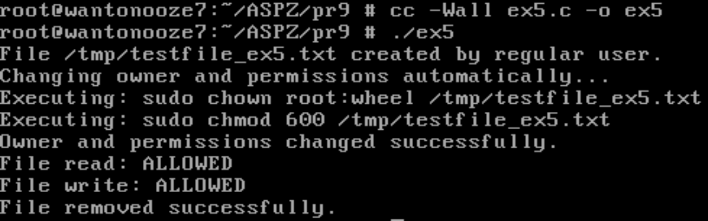

# Практична робота №9  
**Тема:** Права доступу, власники, UID, GID, запуск програм і файлів у UNIX/Linux

---

**У UNIX/Linux-файлових системах, щоб запустити файл як програму або скрипт, необхідно, щоб були виставлені права на виконання (x). Однак існує виняток: якщо скрипт не має прав на виконання, але має права на читання, його можна передати як аргумент до інтерпретатора напряму.**

---

## Завдання 1

##Опис реалізації 

Програма  виводить список звичайних користувачів системи (UID > 1000), окрім поточного користувача.
Вона використовує команду getent passwd для отримання інформації про всі облікові записи, розбирає кожен рядок, виділяє ім'я користувача та UID, і виводить тих, хто відповідає умові.
Поточний користувач визначається через getlogin(), щоб його не показувати у списку.

**Основні етапи:**

- Викликає `getent passwd` через `popen()` для читання списку користувачів.  
- Для кожного рядка розбиває поля за допомогою `strtok_r`.  
- Перевіряє, чи `UID > 1000` і чи не співпадає ім'я з поточним користувачем.  
- Виводить відповідних користувачів.  

Це дозволяє швидко побачити, які звичайні облікові записи існують у системі, окрім вашого.


**Реалізація:**  
[`ex1.c`](ex1.c)


---

## Завдання 2

### Опис реалізації

Програма демонструє спробу отримати доступ до захищеного системного файлу (`/etc/master.passwd`) від імені адміністратора, навіть якщо вона запущена звичайним користувачем.

**Основні етапи:**

- Використовує `popen()` для запуску команди `sudo cat /etc/master.passwd` і читання її виводу.  
- Якщо команда не виконується, виводить повідомлення про помилку.  
- Якщо доступ отримано, виводить вміст файлу построково.  
- Після завершення закриває потік.

Помилка виникає через спробу виконання команди `sudo` від імені звичайного користувача без відповідних прав у файлі `sudoers`.
Таким чином, команда не виконується, доступ до захищеного файлу не надається.

---

Це повідомлення означає, що звичайний користувач, який запустив програму, не має права використовувати команду
```freebsd
user is not in the sudoers file.
This incident has been reported to the administrator.
```

---

Користувач, який не входить до sudoers, не може виконувати команди з sudo, і це призводить до помилок у програмах, які потребують адміністративних прав. Це стандартний механізм безпеки в UNIX-подібних системах.

Запуск програми за допомогою sudo ./ex2 ситуацію не змінює. 


**Реалізація:**  
[`ex2.c`](ex2.c)


---

## Завдання 3

**Опис:**  
Файл /tmp/userfile.txt створюється звичайним користувачем без проблем. Далі, коли програма виконується з правами root, вона копіює цей файл у домашній каталог користувача. Оскільки копія створена від імені root, її власником є root, і звичайний користувач не може змінити її без прав на запис. При спробі редагування відкриття файлу завершується з помилкою. Щодо видалення — воно можливе, оскільки директорія /home/user/ належить самому користувачу і має права на зміну вмісту. Видалення виконується успішно, навіть якщо сам файл створений root'ом.

**Реалізація:**  
[`ex3.c`](ex3.c)


---

## Завдання 4

**Опис:**  

Програма послідовно виконує системні команди whoami та id за допомогою функції popen(), щоб визначити ім’я користувача, від імені якого вона запущена, та вивести його ідентифікатори (UID, GID) і список груп, до яких він належить, що дозволяє перевірити рівень доступу користувача в системі.

**Реалізація:**  
[`ex4.c`](ex4.c)


---

## Завдання 5

**Опис:**  
По суті це має рпацювати так:
Програма створює файл /tmp/testfile_ex5.txt від імені звичайного користувача, записує до нього тестовий рядок, а потім за допомогою команд sudo змінює власника файлу на root:wheel та встановлює права доступу 600 (доступ тільки для власника). Далі вона перевіряє, чи може звичайний користувач прочитати, дописати або видалити файл після зміни прав доступу, демонструючи обмеження доступу до файлів, що належать root-користувачу. Якщо звичайний користувач не може видалити файл, програма намагається зробити це знову через sudo.

Але через неможливість надати найвиший рівень доступу звичайному користувачу цвиконання цього завдання для звичайного коричтувача стає неможливо 

[Повідомлення про помилку (див. завдання 2)](#завдання-2)

**Реалізація:**  
[`ex5.c`](ex5.c)




---

## Завдання 6

**Опис:**  
Програма демонструє базову перевірку доступу до системних файлів і каталогів у UNIX-подібній системі. Вона:

**Функціональність:**

- Виводить вміст:
  - домашнього каталогу користувача
  - `/usr/bin` (перші 10 файлів)
  - `/etc` (перші 10 файлів)

- Перевіряє доступ до файлів:
  - `/etc/passwd`
  - `/etc/shadow`
  - `/usr/bin/ls`
  - `/usr/bin/sudo`
  - `/etc/hosts`
  - `/etc/ssh/sshd_config`

- Для кожного з них виконує:
  - читання (R)
  - запис (W)
  - виконання (X)

**Позначення доступу:**

- `A` — Access allowed (доступ дозволено)  
- `D` — Denied (доступ заборонено)

**Реалізація:**  
[`ex6.c`](ex6.c)


---

## Варіативне завдання 19

### Опис

Програма демонструє спробу підняти привілеї поточного процесу до root-користувача за допомогою системного виклику `setuid(0)`, де `0` — це UID користувача root.

**Основні етапи:**

- Викликає `setuid(0)` для зміни ефективного UID на `root`.
- Якщо помилка:
  - виводить результат `whoami`
  - повідомлення через `perror("setuid")`
- Якщо успіх:
  - виводиться `"Executing command as root..."`
  - ще раз виконується `whoami`

**Реалізація:**  
[`ex19.c`](ex1c)


---